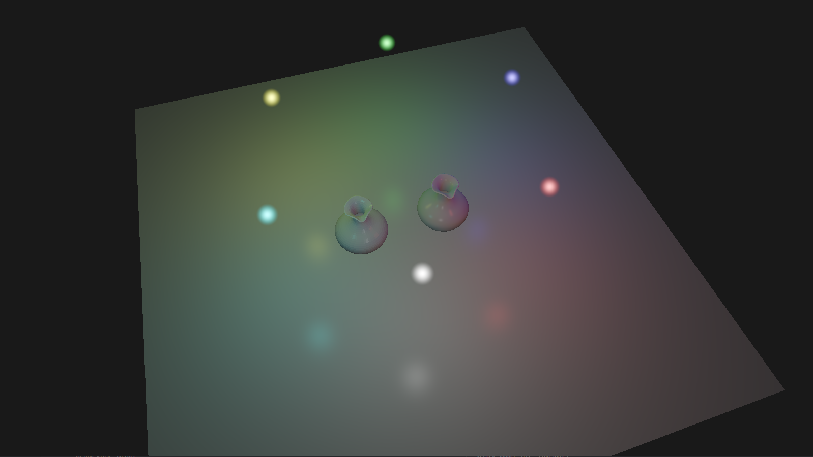

# ModernGL, OpenGL and Vulkan API graphics rendering

_An open exploration of modern 3D rendering in ModernGL, OpenGL and Vulkan._

`👀 Be an early user on my discord for discussions on OpenGL, Vulkan, and game development. I'll also be in the ModernGL discord too. - Charlie` <https://discord.gg/Bkhpm8QQ>

I've written a summary of the code eco-system and setup guide for newbies; then a series of subsections with code demonstrations of techniques with an associated code folder provided in this repo for you to explore.

## Vulkan C++23, Cmake 4.0, and GLFW

Each project is a standalone example working with C++23 GNU, and CMake 4.
If you know what to do and don't need any flavour then skip down to the projects; otherwise if you want tips for Windows development then read on.

I use the modern FetchContent feature from CMake to pull the libraries from their respective repositories where possible, GLFW, GLM, etc. However Vulkan itself is included manually, similar to the Opengl examples.

The _Khronos OpenGL Specification_ is available on the web:
<https://registry.khronos.org/vulkan/specs/latest/html/vkspec.html>. A list of hardware that supports this is available online: <https://vulkan.gpuinfo.org/>.

I have learned a lot from a great tutorial series for C++ and Vulkan by Brendan Galea: <https://www.youtube.com/playlist?list=PL8327DO66nu9qYVKLDmdLW_84-yE4auCR>.

Before we get to the projects in this repository, here is how I have set up my projects:

1.  Create a project directory, and inside here we do the following:

    - Don't use spaces in the project name for full compatibility, especially if you are using my build batch files.

    - A `CMakeLists.txt` file at the root of your project.

    - A `src` directory for your code.

    - A `src/main.cpp` file to start your application.

    - An `external` directory for any external libraries you need. Note that I have placed this one level up from the root of each project so that it can be shared across multiple projects.
    
    - This is the same for the `asset` directory, which you will use to store assets like textures and models. You can place this inside the root if you like, but remember this when you are configuring your build.

2.  You will need to install Cmake 4.0.x: <https://cmake.org/download/>, and add the bin folder to your _PATH_, for example I have added `C:\Cmake\bin` to my PATH.

    - Test for the installation by running `cmake --version` in a terminal.

    - If you want to use your older version then fine, but looking at the deprecation warnings and the issues you will have with version policies. I recommend to just update and avoid all of it.

3.  You will need to install a compiler, I'm going to point you to 64 bit `gcc` and `g++` compilers from MinGW:

    - Install `MinGW Portable C, C++, and Fortran Development Kit for x64` from: <https://github.com/skeeto/w64devkit>. I use directory `C:/MinGW`.

    - Add the bin folder of MinGW Portable to your _PATH_ environment variable, such as `C:\MinGW\bin`.

    - Test for the installation by running `gcc --version` or `g++ --version` in a terminal.

    - An additional compiler that replaces `GNU make` is `ninja` developed by _Google_ in 2012. Said to be significantly faster on larger projects.

    - Get the release from: <https://github.com/ninja-build/ninja>. If you want to use this install MinGW first and then copy the `ninja.exe` into the `C:\MinGW\bin` directory.

    - Test for the installation by running `ninja --version` in a terminal.

4.  Download and prepare the Vulkan library manually:

    Vulkan SDK: <https://vulkan.lunarg.com/sdk/home>.
    - Install the Vulkan SDK.
    - In start menu look for VulkanCube and run it to check if Vulkan is installed correctly.
    - Browse to install directory and copy the `include` and `lib` folders to a subfolder such as `external/vulkan`.
    - The installer adds _VK_SDK_PATH_ and _VULKAN_SDK_ to your environment. Also, `C:/vulkan/Bin` to your _PATH_.

    The external files directory should have a structure as follows:

    ```
    parent
    ├──external/
    │   └── vulkan/
    │       ├── Include/
    │       │       └── vulkan/
    │       │       └── glm/
    │       │       └── sdl2/
    │       │       └── etc
    │       └── Lib/
    │           └── vulkan-1.lib
    │           └── etc
    └── project
        ├──src/
        │    ├── main.cpp
        │    ├── app.cpp
        │    └── vulkan_glfw/
        │           └── <engine code>
        └── CMakeLists.txt
    ```

    I have placed my `external` directory one level above the project root, this is reflected in the path inside the `CMakeLists.txt` files in each project.

5.  Additional support for compiling shader programs

    - Create a file called `shader_compile.bat`. Open this file and paste the code:

        ```bat
        @echo off

        REM Look for any .vert .geom or .frag file and compile them to SPIR-V
        for /R "./shaders" %%f in (*.vert) do (
            echo  - %%~nf.vert
            call glslc.exe %%f -o "./shaders/compiled/%%~nf.vert.spv"
        )
        for /R "./shaders" %%f in (*.geom) do (
            echo  - %%~nf.geom
            call glslc.exe %%f -o "./shaders/compiled/%%~nf.geom.spv"
        )
        for /R "./shaders" %%f in (*.frag) do (
            echo  - %%~nf.frag
            call glslc.exe %%f -o "./shaders/compiled/%%~nf.frag.spv"
        )
        ```

    - If you run this `.bat` file, it will compile all `.vert`, `.geom`, and `.frag` files to `.spv` files.

    - I write the compiled shader files to the `shaders/compiled` directory, to make it easier to separate the source from the compiled files when coding.

    - You can add a `call shader_compile` to your build, compile, or run scripts to perform this automatically.

6.  Building a one file test program to create a window:

    - Create a new file `main.cpp` in the project:

        ```cpp
        #define GLFW_INCLUDE_VULKAN
        #include <GLFW/glfw3.h>
        //
        #define GLM_FORCE_RADIANS
        #define GLM_FORCE_DEPTH_ZERO_TO_ONE
        #include <glm/vec4.hpp>
        #include <glm/mat4x4.hpp>

        #include <iostream>

        void testVulcan() {
            glfwInit();
            glfwWindowHint(GLFW_CLIENT_API, GLFW_NO_API);
            GLFWwindow* window = glfwCreateWindow(1600, 900, "Vulkan window", nullptr, nullptr);
            uint32_t extensionCount = 0;
            vkEnumerateInstanceExtensionProperties(nullptr, &extensionCount, nullptr);
            glm::mat4 matrix;
            glm::vec4 vec;
            auto test = matrix * vec;
            while (!glfwWindowShouldClose(window)) {
                glfwPollEvents();
            }
            glfwDestroyWindow(window);
            glfwTerminate();
        }

        int main() {
            try {
                testVulcan();
            }
            catch (const std::exception& e) {
                std::cerr << e.what() << '\n';
                return EXIT_FAILURE;
            }
            return EXIT_SUCCESS;
        }
        ```

7.  To create the build files:

    - Use the `.bat` files that I have included for building, compiling, and running.

        - So with a terminal run `build development` to create the Cmake build and then `compile development` to compile the executable. If you changed where `external` is you need to modify the `build.bat` script to point where you have it relative to your `CMakeLists.txt`.

        - I added flags to control the builds, so use `debug`, `development`, or `release` as you wish. Debug will enable debug flags in the compiler, but code will be slower. Development for fast runtime inside your dev environment. Release for when you move the resources to the deployment build.

        - If you want to use ninja then use `build development ninja` and `compile development ninja`.

        - I also added a `run.bat` file to call the exe from the correct build directory, for the lazy like me.

        - Open the `.bat` files to see the commands used and make use of them in a terminal.

        - Remember if you add or rename source files, you will need to build before compiling.

    - For alternate building and compiling please see the OpenGL C++ section.

8. On formatting I'm using VSCode and the C++ extension from Microsoft, and it is easy to set the style. I prefer the google format which tidies up the braces. If you want to match this then find the setting for `c_Cpp Clang_fallback_format style` and set it: `{ BasedOnStyle: Google, IndentWidth: 4, ColumnLimit: 0 }`.

### cpp_vlk_1.a_triangle - Triangle rendered with vulkan

This example is a simple triangle rendered with Vulkan using a vertex and fragment shader.


### cpp_vlk_2.a_blinn_phong - Blinn-Phong shading with multiple dynamic lights

This project is my implementation from Brendan Galea's tutorials.



There are some differences to how this is set up, noted as follows:

- I preferred to place rendering, glfw, and vulkan classes inside a sub-directory called 'vulkan_glfw'.

- In terms of coding style I have not used namespace definition regions, I found it hard to read, and I have opted to use namespace single identifiers where possible.

- In the build.bat file (if you use it), I have included a rudimentary release part of the script that will copy assets to where the `.exe` is built. This is handy for quick testing of a release with compile time macros, in particular in this demo note the preprocessor macros used to control paths, such as the shaders:

    In `point_light.cpp` and `simple_render.cpp`.:

    ```c++
    string root_path = "../../../shaders/compiled/";
    #ifdef COMPILE_RELEASE
        root_path = "shaders/";
    #endif
    ```

    And for the model files in `model.cpp`:

    ```c++
    string root_path = "../../../../";
    #ifdef COMPILE_RELEASE
        root_path = "";
    #endif
    ```

    See `release.txt` for the _**from=to**_ path pairs that I'm asking the script to copy. This is just a quick thing I came up with to go with my batch scripts, since I am building to individual folders depending on what what used to compile, and I would probably create scripts in something more robust such as python.
